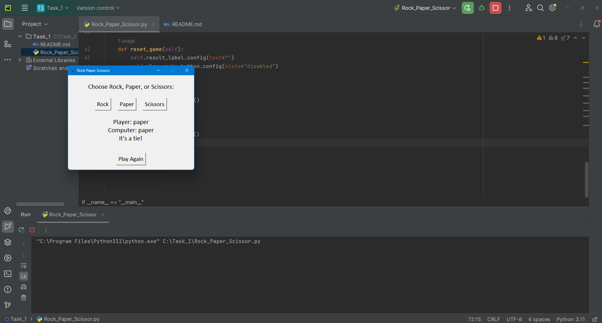

# Rock Paper Scissors GUI Game

This project is a simple Rock-Paper-Scissors game developed using Python's `tkinter` library. It provides a graphical user interface for playing the game against the computer.

## Table of Contents

- [Features](#features)
- [Installation](#installation)
- [Usage](#usage)
- [Code Structure](#code-structure)
- [Screenshots](#screenshots)
- [License](#license)

## Features

- User-friendly GUI to play Rock, Paper, Scissors.
- Displays both the player's and computer's choices.
- Displays the result of each game (win, lose, or tie).
- Option to play again or quit the game.

## Installation

1. **Clone the repository:**

   ```sh
   git clone https://github.com/yourusername/rock-paper-scissors-gui.git
   ```

2. **Navigate to the project directory:**

   ```sh
   cd rock-paper-scissors-gui
   ```

3. **Install required dependencies:**

   Ensure you have Python installed. This project uses the `tkinter` library, which is included with most Python installations.

## Usage

1. **Run the application:**

   ```sh
   python rock_paper_scissors_gui.py
   ```

2. The game window will open. Click on "Rock", "Paper", or "Scissors" to make your choice.

3. The result of the game will be displayed. Click "Play Again" to start a new game or "Quit" to exit.

## Code Structure

- `rock_paper_scissors_gui.py`: Main application file containing the `RockPaperScissors` class and the logic for the game.

### Key Classes and Functions

- **`RockPaperScissors`**: Main class for the Rock-Paper-Scissors game.
  - **`__init__`**: Initializes the game window and components.
  - **`create_widgets`**: Creates the widgets for the game (buttons, labels).
  - **`play`**: Handles the logic for playing a round of the game.
  - **`reset_game`**: Resets the game state for a new round.
  - **`run`**: Runs the main loop of the application.

## Screenshots

Add relevant screenshots of your application here.



## License

This project is licensed under the MIT License - see the [LICENSE](LICENSE) file for details.

---

This project was created as part of an internship at CodSoft, Batch 47. For any queries or issues, please contact `imanjunad@gmail.com`.
